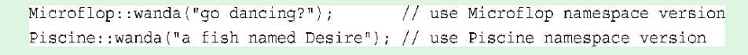

多态让您能够为运算符和函数创建多个定义， 通过编程上下文来确定使用哪个定义。
 继承让您能够使用旧类派生出新类。   

对象是类的特定实例， 而类定义了数据的存储和使用方式

然而， 通常， main( )被启动代码调用， 而启动代码是由编译器添加到程序中的， 是程序和操作系统（UNIX、 Windows 7或其他操作系统） 之间的桥梁。 事实上， 该函数头描述的是main( )和操作系统之间的接口 。

# 名称空间 namespace

使用namespace 是为了避免 不同厂家的已封装代码中有两个相同

namespace 可以让不同厂家的代码封装在一个 `namespace`的单元中，这样就可以用名称空间的名称来指出想使用哪个厂商的产品。 因此， Microflop Industries可以将其定义放到一个名为Microflop的名称空间中。 这样， 其wanda( )函数的全
称为Microflop::wanda( )； 同样， Piscine公司的wanda( )版本可以表示为Piscine::wanda( )。
这样， 程序就可以使用名称空间来区分不同的版本了：  

